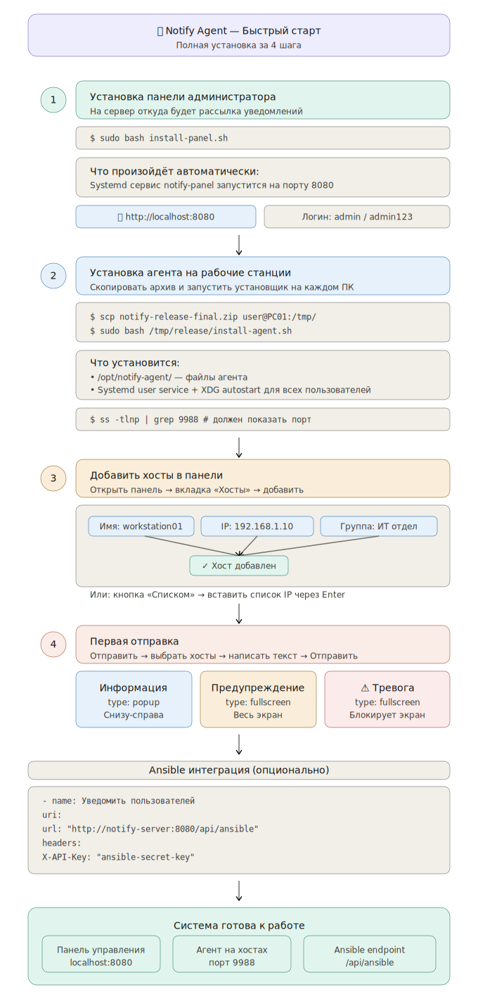

# Notify
Сервер уведомлений под Unix, отправка popup-сообщений, гибкая конфигурация.

# 📢 Notify Agent — Система экстренного оповещения

> Корпоративная система push-уведомлений для ALT Linux с интеграцией Ansible.  
> Полноэкранные и всплывающие уведомления прямо на рабочий стол пользователя.

**Автор:** [@PapaBorscht](https://t.me/PapaBorscht)  
**Платформа:** Unix, Python 3.8+  
**Версия:** 3.0

---
# 💻 Кросс-платформенность


### Поддерживаемые дистрибутивы ОС

| Alt Linux  10.4        | Astra Linux 1.8         | Red OS  8.02           |
|------------------------|-------------------------|------------------------|
| ✅ **Поддерживается**  | ✅ **Поддерживается**   | ✅ **Поддерживается**  |

## 🚀 Быстрый старт 

Установка панели управления (Control Panel):
cd /tmp
wget https://github.com/PapaBorscht/Notify/archive/refs/heads/main.zip
unzip main.zip
cd /tmp/Notify-main/
sudo bash install-panel.sh

Установка клиента на хосте:
cd /tmp
wget https://github.com/PapaBorscht/Notify/archive/refs/heads/main.zip
unzip main.zip
cd /tmp/Notify-main/
sudo bash install-agent.sh

## 📸 Скриншоты

### Полноэкранное уведомление — Информация

> Уровень "info" — тёмно-синий фон. Занимает весь экран, блокирует работу до подтверждения. Заголовок, Markdown-текст и кнопка «Принял к сведению».

### Полноэкранное уведомление — Тревога

> Уровень "critical" — тёмно-красный фон. Используется для экстренных событий: воздушная тревога, атаки на инфраструктуру, критические инциденты.

### Всплывающий попап — отправка из панели

> Уровень "info", тип "popup" — маленькое окно справа внизу. Не мешает работе пользователя, закрывается автоматически по таймеру с прогресс-баром.

### Всплывающий попап — уровень Тревога

> Уровень "warning", тип "popup". Цветная полоска сверху и метка уровня меняются в зависимости от "level".

### Ansible — отправка уведомления из плейбука

> Ansible плейбук выполняет POST на "/api/ansible" с "X-API-Key". Попап появляется на рабочем столе пользователя пока идёт установка обновлений.

### Ansible — уведомление об обновлении безопасности

> Уровень "warning" — красная полоска. Пользователь видит уведомление и знает что компьютер нельзя выключать.

---

## ✨ Возможности

- **Два типа окон** — полноэкранное (блокирует экран) и всплывающий попап (не мешает работе)
- **Три уровня** — "info" (синий), "warning" (оранжевый), "critical" (красный)
- **Markdown** в тексте уведомлений — "## заголовки", "**жирный**", "> цитаты"
- **Ansible интеграция** — endpoint "/api/ansible" с "X-API-Key", без браузерной авторизации
- **Параллельная рассылка** — "ThreadPoolExecutor", настраиваемое число потоков
- **Веб-панель** — управление хостами, шаблонами, историей, настройками
- **Трей-агент** — иконка в системном трее, статус, счётчик, тест
- **Автозапуск** — systemd user service + XDG autostart
- **Нет зависимостей** кроме Python 3 и PyQt5 (входит в базовый ALT Linux)

---

## 🏗 Архитектура


"""
Браузер / Ansible
      │
      ▼
server.py :8080          ← Веб-панель администратора
      │
      │  HTTP POST :9988
      ├──────────────────► PC01 agent.py  →  [Fullscreen]
      ├──────────────────► PC02 agent.py  →  [Popup]
      └──────────────────► PC03 agent.py  →  [Fullscreen]
"""

### Логика выбора типа окна

| "type" в запросе | "level" | Результат |
|---|---|---|
| ""fullscreen"" | любой | Полный экран |
| ""popup"" | любой | Попап снизу-справа |
| не указан | "critical" / "warning" | Полный экран |
| не указан | "info" | Попап |

---

## 🚀 Быстрый старт

### Установка агента на рабочие станции

```bash
sudo bash install-agent.sh

Скрипт автоматически:
- Устанавливает PyQt5 если нет
- Копирует файлы в "/opt/notify-agent/"
- Настраивает systemd user service и XDG autostart
- Запускает агента в активных X11-сессиях

### Установка панели администратора

```bash
sudo bash install-panel.sh


Открыть в браузере: "http://localhost:8080"  
Логин: "admin" / Пароль: "admin123"

### Проверка

```bash
# Агент слушает порт?
ss -tlnp | grep 9988

# Тест напрямую
curl -X POST http://127.0.0.1:9988 \
  -H "X-Token: supersecrettoken123" \
  -H "Content-Type: application/json" \
  -d '{"title":"Тест","message":"## Работает!","level":"info"}'
"""

---

## 🤖 Ansible интеграция

### Простой вызов

```bash
curl -X POST http://notify-server:8080/api/ansible \
  -H "X-API-Key: ansible-secret-key" \
  -H "Content-Type: application/json" \
  -d '{
    "title":   "⚠️ Обновление ядра",
    "message": "## Не выключайте компьютер!\n\nИдёт установка.",
    "level":   "warning",
    "type":    "popup",
    "timeout": 15,
    "hosts":   ["192.168.1.10"]
  }'

### Плейбук обновления ядра (пример) хосты находятся в hosts
---
- name: Обновление ядра
  hosts: workstations
  gather_facts: false
  become: yes

  tasks:

    - name: Уведомить — начало
      uri:
        url: "http://192.168.0.84:8080/api/ansible"
        method: POST
        headers:
          Content-Type: "application/json"
          X-API-Key: "ansible-secret-key"
        body_format: json
        body:
          title: "⚠️ Обновление ядра"
          message: "## Не выключайте компьютер!\n\nНачинается обновление."
          level: "warning"
          type: "popup"
          timeout: 15
          hosts:
            - "{{ inventory_hostname }}"
      become: false

    - name: apt-get update
      command: apt-get update

    - name: update-kernel
      command: update-kernel -y

    - name: Уведомить — готово
      uri:
        url: "http://192.168.0.84:8080/api/ansible"
        method: POST
        headers:
          Content-Type: "application/json"
          X-API-Key: "ansible-secret-key"
        body_format: json
        body:
          title: "✅ Готово"
          message: "## Обновление завершено!\n\nПерезагрузка..."
          level: "info"
          type: "popup"
          timeout: 10
          hosts:
            - "{{ inventory_hostname }}"
      become: false

    - name: Перезагрузка
      reboot:
        reboot_timeout: 3000

### Плейбук обновление дистрибутивов (пример) хосты находятся в hosts

---
- name: Обновление дистрибутивов
  hosts: workstations
  gather_facts: false
  become: yes

  tasks:

    - name: Уведомить — начало
      uri:
        url: "http://192.168.0.84:8080/api/ansible"
        method: POST
        headers:
          Content-Type: "application/json"
          X-API-Key: "ansible-secret-key"
        body_format: json
        body:
          title: "⚠️ Обновление пакетов"
          message: "## Не выключайте компьютер!\n\nНачинается обновление."
          level: "warning"
          type: "popup"
          timeout: 15
          hosts:
            - "{{ inventory_hostname }}"
      become: false

    - name: apt-get update
      command: apt-get update

    - name: dist upgrade
      command: apt-get dist-upgrade -y

    - name: Уведомить — готово
      uri:
        url: "http://192.168.0.84:8080/api/ansible"
        method: POST
        headers:
          Content-Type: "application/json"
          X-API-Key: "ansible-secret-key"
        body_format: json
        body:
          title: "✅ Готово"
          message: "## Обновление завершено!\n\nПакеты успешно обновлены..."
          level: "info"
          type: "popup"
          timeout: 10
          hosts:
            - "{{ inventory_hostname }}"
      become: false

#    - name: Перезагрузка
#      reboot:
#        reboot_timeout: 30000


## 📁 Структура проекта

"""
notify-agent/
├── agent.py              # Агент — трей + HTTP + окна уведомлений
├── agent-start.sh        # Wrapper-скрипт запуска (ждёт X11, проверяет порт)
├── server.py             # Веб-сервер панели администратора
├── sender.py             # Отправщик (CLI + библиотека)
├── index.html            # SPA панель управления
├── notify-agent.service  # Systemd user service
├── install-agent.sh      # Установщик агента
├── install-panel.sh      # Установщик панели
├── test_notify.py        # Автотесты (50 тестов)
└── DOCUMENTATION.md      # Полная документация (16 разделов)
"""

---

## ⚙️ Настройка

В "server.py":

"""python
ADMIN_PASSWORD = "admin123"          # Пароль веб-панели

AGENT_TOKEN    = "supersecrettoken123"  # Токен агента (совпадает с agent.py)

SEND_SETTINGS = {
    "max_workers":  50,  # Потоков параллельно
    "send_timeout": 3,   # Секунд ждать ответа от агента
}

ANSIBLE_SETTINGS = {
    "api_key": "ansible-secret-key"  # API ключ для Ansible
}
"""

В "agent.py":

"""python
PORT  = 9988                    # Порт HTTP сервера агента
TOKEN = "supersecrettoken123"   # Совпадает с server.py
POPUP_DEFAULT_TIMEOUT = 8       # Секунд до закрытия попапа
"""

---

## 🔧 Управление

```bash
# Агент (от пользователя)
systemctl --user status  notify-agent
systemctl --user restart notify-agent
tail -f /tmp/notify-agent-$(whoami).log

# Панель (root)
systemctl status  notify-panel
systemctl restart notify-panel
journalctl -u notify-panel -f

# Автотесты
python3 test_notify.py
"""

---

## 🧪 Автотесты

"""
$ python3 test_notify.py

Ran 50 tests in 10.2s
OK

Всего тестов:  50
Прошло:        50
Провалено:     0
Ошибок:        0
"""

Покрытие: логика агента, сессии, файлы данных, отправщик, все HTTP endpoints.

---

## 📋 Требования

| Компонент | Требование |
|---|---|
| ОС | ALT Linux (Сизиф, p10, p11) |
| Python | 3.8+ |
| PyQt5 | "apt-get install python3-module-pyqt5" |
| DE | MATE, KDE, XFCE, GNOME (X11) |
| Сеть | TCP порт 9988 (агент), 8080 (панель) |

---

## 📄 Лицензия

MIT — используй свободно.

---

*Разработано для автоматизации оповещения в корпоративной инфраструктуре на ALT Linux.*
