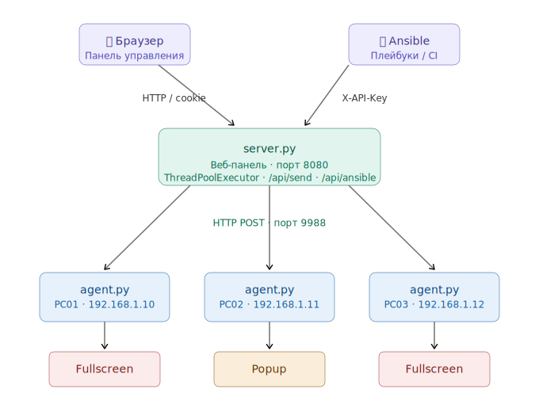

# 📢 Notify — Система экстренного оповещения

> При воздушной тревоге, атаке на инфраструктуру или любом критическом событии — полноэкранное окно с захватом клавиатуры мгновенно появляется на всех экранах и не даёт его закрыть пока пользователь не подтвердит прочтение. Помимо тревог,уведомления отлично встраиваются в Ansible-плейбуки, Bash скрипты, Puppet манифесты: при установке ПО или обновлении ядра агент показывает попап снизу-справа с таймером.


**Автор:** [@PapaBorscht](https://t.me/PapaBorscht)<br>
**Почта:** [me@ntfypush.ru](mailto:me@ntfypush.ru)<br>
**Сайт:** [papaborscht.github.io/Notify](https://papaborscht.github.io/Notify/)<br>
**Демо:** [papaborscht.github.io/Notify/demo](https://papaborscht.github.io/Notify/demo)
  
**Платформа:** GNU/Linux · Python 3.8+  
**Версия:** 3.0  
**Лицензия:** MIT

---

## 🚀 Быстрый старт

**Установка панели управления:**

```bash
cd /tmp
wget https://github.com/PapaBorscht/Notify/archive/refs/heads/main.zip
unzip main.zip
cd /tmp/Notify-main/
bash install-panel.sh
```

**Установка агента на хосте:**

```bash
cd /tmp
wget https://github.com/PapaBorscht/Notify/archive/refs/heads/main.zip
unzip main.zip
cd /tmp/Notify-main/
bash install-agent.sh
```
**Установка агента на Win:**

```bash

Скоро будет...
```


**Доступ к панели управления:**

- **Адрес:** `http://localhost:8080`
- **Логин:** `admin`
- **Пароль:** `admin123`

---

## 📸 Скриншоты

### Панель управления


### Добавляем хосты


### Полноэкранное уведомление — Информация


> Уровень `info` — тёмно-синий фон. Занимает весь экран, блокирует работу до подтверждения. Заголовок, Markdown-текст и кнопка «Принял к сведению».

### Полноэкранное уведомление — Тревога


> Уровень `critical` — тёмно-красный фон. Используется для экстренных событий: воздушная тревога, атаки на инфраструктуру, критические инциденты.

### Всплывающий попап — отправка из панели


> Уровень `info`, тип `popup` — маленькое окно справа внизу. Не мешает работе пользователя, закрывается автоматически по таймеру с прогресс-баром.

### Всплывающий попап — уровень Тревога


> Уровень `warning`, тип `popup`. Цветная полоска сверху и метка уровня меняются в зависимости от `level`.

### Ansible — отправка уведомления из плейбука при установке ПО


> Ansible плейбук выполняет POST на `/api/ansible` с `X-API-Key`. Попап появляется на рабочем столе пользователя пока идёт установка обновлений.

### Ansible — уведомление об обновлении безопасности


> Уровень `warning` — красная полоска. Пользователь видит уведомление и знает что компьютер нельзя выключать.

---

## ✨ Возможности

- **Два типа окон** — полноэкранное (блокирует экран) и всплывающий попап (не мешает работе)
- **Три уровня** — `info` (синий), `warning` (оранжевый), `critical` (красный)
- **Markdown** в тексте уведомлений — `## заголовки`, `**жирный**`, `> цитаты`
- **Ansible интеграция** — endpoint `/api/ansible` с `X-API-Key`, без браузерной авторизации
- **Параллельная рассылка** — `ThreadPoolExecutor`, настраиваемое число потоков
- **Веб-панель** — управление хостами, шаблонами, историей, настройками
- **Трей-агент** — иконка в системном трее, статус, счётчик, тест
- **Автозапуск** — systemd user service + XDG autostart
- **Нет зависимостей** кроме Python 3 и PyQt5

---

## 🏗 Архитектура



### Логика выбора типа окна

| `type` в запросе | `level` | Результат |
|---|---|---|
| `fullscreen` | любой | Полный экран |
| `popup` | любой | Попап снизу-справа |
| не указан | `critical` / `warning` | Полный экран |
| не указан | `info` | Попап |

---

## 🔧 Установка

### Агент на рабочие станции

```bash
bash install-agent.sh
```

Скрипт автоматически:
- Устанавливает PyQt5 если нет
- Копирует файлы в `/opt/notify-agent/`
- Настраивает systemd user service и XDG autostart
- Запускает агента в активных X11-сессиях

### Панель администратора

```bash
bash install-panel.sh
```

Открыть в браузере: `http://localhost:8080`  
Логин: `admin` / Пароль: `admin123`

### Проверка

```bash
# Агент слушает порт?
ss -tlnp | grep 9988

# Тест напрямую
curl -X POST http://127.0.0.1:9988 \
  -H "X-Token: supersecrettoken123" \
  -H "Content-Type: application/json" \
  -d '{"title":"Тест","message":"## Работает!","level":"info"}'
```

---

## 🤖 Ansible интеграция

### Простой вызов

```bash
curl -X POST http://notify-server:8080/api/ansible \
  -H "X-API-Key: ansible-secret-key" \
  -H "Content-Type: application/json" \
  -d '{
    "title":   "⚠️ Обновление ядра",
    "message": "## Не выключайте компьютер!\n\nИдёт установка.",
    "level":   "warning",
    "type":    "popup",
    "timeout": 15,
    "hosts":   ["192.168.1.10"]
  }'
```

### Плейбук обновления ядра

```yaml
---
- name: Обновление ядра
  hosts: workstations
  gather_facts: false
  become: yes

  tasks:

    - name: Уведомить — начало
      uri:
        url: "http://192.168.0.84:8080/api/ansible"
        method: POST
        headers:
          Content-Type: "application/json"
          X-API-Key: "ansible-secret-key"
        body_format: json
        body:
          title: "⚠️ Обновление ядра"
          message: "## Не выключайте компьютер!\n\nНачинается обновление."
          level: "warning"
          type: "popup"
          timeout: 15
          hosts:
            - "{{ inventory_hostname }}"
      become: false

    - name: apt-get update
      command: apt-get update

    - name: update-kernel
      command: update-kernel -y

    - name: Уведомить — готово
      uri:
        url: "http://192.168.0.84:8080/api/ansible"
        method: POST
        headers:
          Content-Type: "application/json"
          X-API-Key: "ansible-secret-key"
        body_format: json
        body:
          title: "✅ Готово"
          message: "## Обновление завершено!\n\nПерезагрузка..."
          level: "info"
          type: "popup"
          timeout: 10
          hosts:
            - "{{ inventory_hostname }}"
      become: false

    - name: Перезагрузка
      reboot:
        reboot_timeout: 300
```

### Плейбук обновления пакетов

```yaml
---
- name: Обновление пакетов
  hosts: workstations
  gather_facts: false
  become: yes

  tasks:

    - name: Уведомить — начало
      uri:
        url: "http://192.168.0.84:8080/api/ansible"
        method: POST
        headers:
          Content-Type: "application/json"
          X-API-Key: "ansible-secret-key"
        body_format: json
        body:
          title: "⚠️ Обновление пакетов"
          message: "## Не выключайте компьютер!\n\nНачинается обновление."
          level: "warning"
          type: "popup"
          timeout: 15
          hosts:
            - "{{ inventory_hostname }}"
      become: false

    - name: apt-get update
      command: apt-get update

    - name: dist-upgrade
      command: apt-get dist-upgrade -y

    - name: Уведомить — готово
      uri:
        url: "http://192.168.0.84:8080/api/ansible"
        method: POST
        headers:
          Content-Type: "application/json"
          X-API-Key: "ansible-secret-key"
        body_format: json
        body:
          title: "✅ Готово"
          message: "## Обновление завершено!\n\nПакеты успешно обновлены."
          level: "info"
          type: "popup"
          timeout: 10
          hosts:
            - "{{ inventory_hostname }}"
      become: false

    # - name: Перезагрузка (раскомментировать если нужно)
    #   reboot:
    #     reboot_timeout: 300
```

---


## 🤖 Bash интеграция, на примере обновления пакетов в RedOS


### Пример скрипта с обратным отсчётом

```bash
#!/bin/bash
# ================================================================
# notify-shutdown.sh
# Обновляет пакеты, показывает обратный отсчёт и выключает АРМ
# ================================================================
DELAY=60        # Общее время до выключения (секунд)
STEP=10         # Интервал обновления попапа
TOKEN="supersecrettoken123"
AGENT="http://127.0.0.1:9988"

notify() {
    local title="$1" msg="$2" level="$3" timeout="$4"
    curl -s -X POST "$AGENT" \
      -H "X-Token: $TOKEN" \
      -H "Content-Type: application/json" \
      -d "{\"title\":\"$title\",\"message\":\"$msg\",\"level\":\"$level\",\"type\":\"popup\",\"timeout\":$timeout}" \
      > /dev/null
}

# ── 1. Обновить пакеты ──────────────────────────────────────────
notify "🔄 Обновление пакетов" "## Идёт обновление системы\n\nНе выключайте компьютер..." "info" $DELAY
dnf update-minimal -y

# ── 2. Обратный отсчёт ─────────────────────────────────────────
remaining=$DELAY
while [ $remaining -gt 0 ]; do
    if   [ $remaining -gt 30 ]; then level="warning"
    elif [ $remaining -gt 10 ]; then level="warning"
    else                              level="critical"
    fi
    notify \
        "⚠️ Выключение через $remaining сек" \
        "## Сохраните работу!\n\nКомпьютер выключится через **$remaining секунд**." \
        "$level" \
        $STEP
    sleep $STEP
    remaining=$((remaining - STEP))
done

# ── 3. Финальное сообщение ──────────────────────────────────────
notify "🔴 Выключение..." "## Компьютер выключается!\n\nДо свидания." "critical" 3
sleep 3

# ── 4. Выключить АРМ ───────────────────────────────────────────
/sbin/shutdown -h now
```

## 🎭 Puppet интеграция

Puppet автоматически раскладывает агент и скрипты на все машины.

### Структура модуля

```
/etc/puppet/modules/notify/
├── manifests/
│   ├── init.pp          ← установка агента
│   └── shutdown.pp      ← скрипт выключения + cron
└── files/
    ├── agent.py
    ├── agent-start.sh
    └── notify-shutdown.sh
```

### Установка агента — `manifests/init.pp`

```puppet
class notify::agent {

  # Файлы агента
  file { '/opt/notify-agent':
    ensure => directory,
    mode   => '0755',
  }

  file { '/opt/notify-agent/agent.py':
    ensure => present,
    source => 'puppet:///modules/notify/agent.py',
    mode   => '0644',
    notify => Exec['restart-notify-agent'],
  }

  file { '/opt/notify-agent/agent-start.sh':
    ensure => present,
    source => 'puppet:///modules/notify/agent-start.sh',
    mode   => '0755',
  }

  # XDG автозапуск
  file { '/etc/xdg/autostart/notify-agent.desktop':
    ensure => present,
    source => 'puppet:///modules/notify/notify-agent.desktop',
    mode   => '0644',
  }

  # Переменные Qt для трея
  file { '/etc/profile.d/notify-agent.sh':
    ensure  => present,
    content => "export QT_QPA_PLATFORMTHEME=\"\"\nexport QT_STYLE_OVERRIDE=\"\"\n",
    mode    => '0644',
  }

  # Перезапустить агента если файлы изменились
  exec { 'restart-notify-agent':
    command     => '/bin/bash -c "pkill -f agent.py; sleep 1"',
    refreshonly => true,
  }

}
```

### Скрипт выключения — `manifests/shutdown.pp`

```puppet
class notify::shutdown {

  # Скрипт из files/
  file { '/usr/local/bin/notify-shutdown.sh':
    ensure => present,
    source => 'puppet:///modules/notify/notify-shutdown.sh',
    mode   => '0755',
  }

  # Cron — каждый день в 22:00
  cron { 'notify-shutdown':
    ensure  => present,
    command => '/usr/local/bin/notify-shutdown.sh',
    user    => 'root',
    hour    => '22',
    minute  => '0',
    require => File['/usr/local/bin/notify-shutdown.sh'],
  }

}
```

### Применить на машины — `site.pp`

```puppet
# Агент на все рабочие станции
node /^workstation/ {
  include notify::agent
  include notify::shutdown
}

# Или на конкретные хосты
node 'pc01.company.ru' {
  include notify::agent
}
```

### Применить вручную

```bash
# На всех агентах (запускается автоматически каждые 30 мин)
puppet agent -t

# Проверить без применения
puppet agent -t --noop
```

## 📁 Структура проекта

```
notify-agent/
├── agent.py              # Агент — трей + HTTP + окна уведомлений
├── agent-start.sh        # Wrapper-скрипт запуска (ждёт X11, проверяет порт)
├── server.py             # Веб-сервер панели администратора
├── sender.py             # Отправщик (CLI + библиотека)
├── index.html            # SPA панель управления
├── notify-agent.service  # Systemd user service
├── install-agent.sh      # Установщик агента
├── install-panel.sh      # Установщик панели
├── test_notify.py        # Автотесты (50 тестов)
└── DOCUMENTATION.md      # Полная документация (16 разделов)
```

---

## ⚙️ Настройка

В `server.py`:

```python
ADMIN_PASSWORD = "admin123"             # Пароль веб-панели
AGENT_TOKEN    = "supersecrettoken123"  # Токен агента (совпадает с agent.py)

SEND_SETTINGS = {
    "max_workers":  50,  # Потоков параллельно
    "send_timeout": 3,   # Секунд ждать ответа от агента
}

ANSIBLE_SETTINGS = {
    "api_key": "ansible-secret-key"  # API ключ для Ansible
}
```

В `agent.py`:

```python
PORT  = 9988                    # Порт HTTP сервера агента
TOKEN = "supersecrettoken123"   # Совпадает с server.py
POPUP_DEFAULT_TIMEOUT = 8       # Секунд до закрытия попапа
```

---

## 🔧 Управление

```bash
# Агент (от пользователя)
systemctl --user status  notify-agent
systemctl --user restart notify-agent
tail -f /tmp/notify-agent-$(whoami).log

# Панель (root)
systemctl status  notify-panel
systemctl restart notify-panel
journalctl -u notify-panel -f

# Автотесты
python3 test_notify.py
```

---

## 🧪 Автотесты

```
$ python3 test_notify.py

Ran 50 tests in 10.2s
OK

Всего тестов:  50
Прошло:        50
Провалено:     0
Ошибок:        0
```

Покрытие: логика агента, сессии, файлы данных, отправщик, все HTTP endpoints.

---

## 🖥 Кроссплатформенность

Протестировано на следующих дистрибутивах и окружениях рабочего стола:

| Дистрибутив | DE | X11 | Wayland |
|---|---|---|---|
| ALT Linux p10 / p11 / Сизиф | MATE | ✅ | ✅ XWayland |
| RedOS 8.0.2 | MATE | ✅ | ✅ XWayland |
| AstraLinux 1.8 | Fly | ✅ | — |
| Ubuntu 22.04 / 24.04 | GNOME | ✅ | ✅ XWayland |
| Debian 12 | XFCE / GNOME | ✅ | ✅ XWayland |

> Wayland поддерживается через XWayland. Нативный Wayland (Layer Shell) в планах.

---

## 📋 Требования

| Компонент | Требование |
|---|---|
| ОС | ALT Linux (Сизиф, p10, p11), RedOS 8.0.2, AstraLinux 1.8, |
| Python | 3.8+ |
| PyQt5 | `apt-get install python3-module-pyqt5` |
| DE | MATE, KDE, XFCE, GNOME (X11 / XWayland) |
| Сеть | TCP порт 9988 (агент), 8080 (панель) можно поменять на свои |

---

## 📄 Лицензия

MIT — используй свободно.
